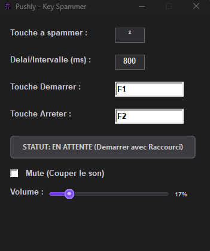

<p align="center">
  
</p>

# Pushly — C++ Win32 Key Spammer

<p align="center">
  <a href="https://github.com/BlaMacfly/Pushly/releases/latest">
    
  </a>
  
  
  
</p>

<p align="center">
  
</p>

Pushly est un logiciel **C++ Win32 extrêmement léger** conçu pour automatiser la
frappe répétée d'une touche, avec une humanisation de l'intervalle pour un rendu
naturel. Développé par **BlaMacfly**.

## Fonctionnalités Principales

- **Intervalle Humanisé** : Chaque frappe utilise un *jitter* gaussien (écart-type
  de 10 % du délai) avec re-seed périodique depuis l'entropie matérielle, pour un
  rythme non répétitif proche d'une frappe humaine.
- **Raccourcis Globaux** : Hotkeys de Démarrage et d'Arrêt configurables,
  fonctionnant même lorsque l'application est en arrière-plan.
- **Retour Sonore** : Sons de démarrage/arrêt (`start.mp3` / `stop.mp3`) avec
  contrôle du volume et bouton *Mute*.
- **Interface Dark Mode** : GUI native Win32 redessinée, avec barre de titre
  sombre (Windows 10 1809+).
- **Sauvegarde Automatique** : Persistance immédiate des réglages dans un fichier
  `config.ini` portable (auto-save chaque seconde).

## Utilisation

1. Lancez `Pushly.exe`.
2. Renseignez la **touche à spammer** et le **délai/intervalle** (en ms).
3. Définissez les raccourcis **Démarrer** (défaut `F9`) et **Arrêter** (défaut `F10`).
4. Réglez éventuellement le **volume** ou activez **Mute**.
5. Appuyez sur le raccourci Démarrer depuis n'importe quelle fenêtre ; réappuyez
   sur Arrêter pour stopper. Les réglages sont sauvegardés automatiquement.

## Configuration (`config.ini`)

Le fichier est généré à côté de l'exécutable. Clés disponibles sous `[Settings]` :

| Clé         | Description                              | Défaut |
|-------------|------------------------------------------|--------|
| `Key`       | Touche envoyée                           | `1`    |
| `Delay`     | Intervalle moyen entre frappes (ms)      | `50`   |
| `StartVK`   | Virtual-Key du raccourci Démarrer        | `112` (F9)  |
| `StartMods` | Modificateurs du raccourci Démarrer      | `0`    |
| `StopVK`    | Virtual-Key du raccourci Arrêter         | `113` (F10) |
| `StopMods`  | Modificateurs du raccourci Arrêter       | `0`    |
| `Muted`     | Son coupé (`1`) ou non (`0`)             | `0`    |
| `Volume`    | Volume MCI (0–1000)                      | `300`  |

## Architecture

Application monolithique en C++ pur (`main.cpp`) utilisant directement l'API
Win32 via `SendInput()`. Aucune dépendance externe lourde : empreinte CPU et
mémoire négligeable. Le rendu de l'UI est intégralement *owner-drawn* (boutons,
barre de volume) pour un thème sombre cohérent.

## Compilation

Le projet se compile avec les **Build Tools de Visual Studio 2019** (ou plus
récent). Un script **`build.cmd`** est fourni : il configure `VsDevCmd.bat`,
compile les ressources (`rc.exe`) puis le code (`cl.exe`).

```cmd
build.cmd
```

L'icône déclarée dans `resource.rc` est automatiquement intégrée à l'exécutable
final. Une variante PowerShell (`build.ps1`) régénère au passage l'icône depuis
le logo via `convert_ico.ps1`.

## ⚠️ Avertissement

Cet outil automatise des saisies clavier. L'utilisation d'automatisation dans des
logiciels ou jeux en ligne peut enfreindre leurs **Conditions d'Utilisation** et
entraîner des sanctions. Utilisez Pushly de manière responsable et uniquement là
où l'automatisation est autorisée. L'auteur décline toute responsabilité quant à
l'usage qui en est fait.

## Licence

Distribué sous licence **MIT**. Voir [`LICENSE`](LICENSE).
